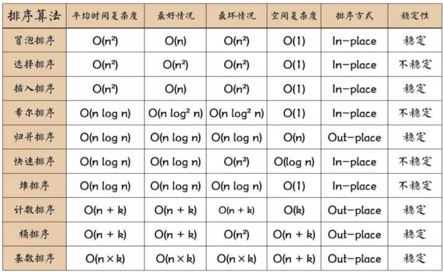

# leetcode-zhs
LeetCode上的代码练习.   

## 动态规划

## 排序

## 博客 
* [一个方法团灭nSum问题](https://mp.weixin.qq.com/s/fSyJVvggxHq28a0SdmZm6Q)
* [k个一组翻转链表](https://mp.weixin.qq.com/s/A-dQ9spsP_Iu1Y4iCRP9nA)  &emp; [递归翻转链表的一部分](https://labuladong.gitbook.io/algo/shu-ju-jie-gou-xi-lie/di-gui-fan-zhuan-lian-biao-de-yi-bu-fen)
* [快速幂：与运算与移位运算](https://leetcode-cn.com/problems/powx-n/solution/50-powx-n-kuai-su-mi-qing-xi-tu-jie-by-jyd/)